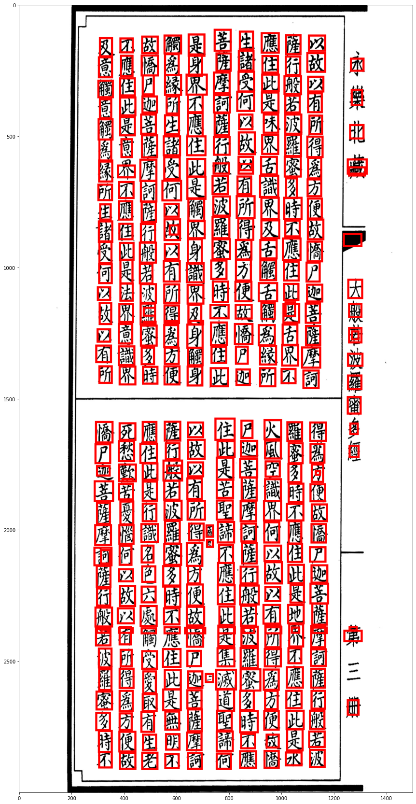
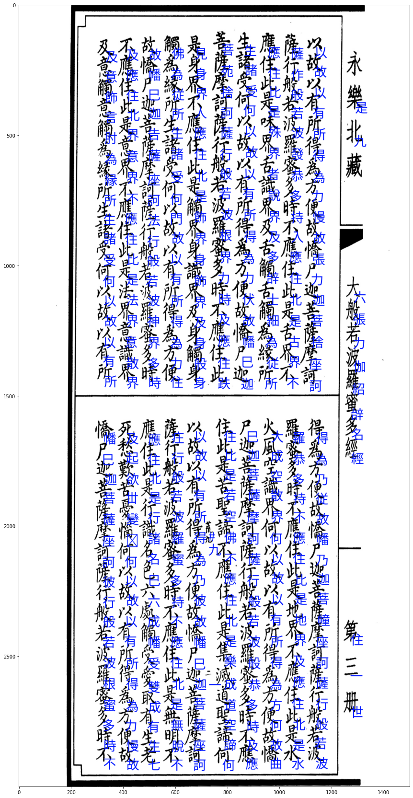

# OCR Chữ Nôm, nhưng nó lạ lắm!

Đồ án môn học Nhập môn xử lí ngôn ngữ tự nhiên - Introduction to Natural Language Processing (CSC15006).

Nhóm SV thực hiện:

|MSSV|Họ tên|
|-----|-----|
|19120338|Trần Hoàng Quân|
|19120266|Nguyễn Hoàng Anh Kiệt|
|19120179|Võ Trương Trung Chánh|

## Tóm tắt:
Với bài toán OCR (Optical Character Recognition - Nhận dạng kí tự quang học) chữ Nôm, hướng giải quyết được đưa ra như sau:
- Segmentation: dùng CenterNet dựng heatmap và vẽ bounding box cho mỗi chữ.
- Recognition: dùng recognition model tương tự bài toán nhận dạng chữ viết tay (Handwritten recognition).

## Kết quả
Detection:



Recognition:



## Mã nguồn:
Trong repository này chứa:
- `create_data.py`: Tạo file .csv gồm tên file ảnh và nhãn từng chữ Nôm ban đầu.
- `crop_image.py`: Crop ảnh thành các file nhỏ để train recognition model, dùng cho bước 3 link [2] (xem tài liệu tham khảo). Thực chất mình không dùng đến :/
- `train_recognition.ipynb`: Train recognition, dùng 50 ảnh đầu của dataset (16311 samples, 1144 classes).
- `train_detection_with_centernet.ipynb`: Train segmentation model sử dụng CenterNet. Có demo pipeline khi hoàn tất.
- `demo/engine.py`: OCR_Chu_Nom_Engine xây dựng từ code trong 2 file notebook bên trên.
- `demo/predict.py`: Chạy file này để thấy phép thuật của làng Lá.

### Demo:
Cài đặt các package cần thiết:
```
cd demo
pip install -r requirements.txt
```

Chạy `predict.py`:
```
python predict.py --input=<file ảnh input> [--print_image (nếu cần in ra ảnh có bounding box và label)]
```

## Các tài liệu tham khảo:
- [1] basu369victor - [Kuzushiji Recognition just like Digit Recognition](https://www.kaggle.com/basu369victor/kuzushiji-recognition-just-like-digit-recognition/notebook)
- [2] kmat2019 - [CenterNet -Keypoint Detector-
](https://www.kaggle.com/kmat2019/centernet-keypoint-detector)

## Trân trọng cảm ơn:
- basu369victor - Kuzushiji Recognition just like Digit Recognition
- kmat2019 - CenterNet -Keypoint Detector-
- Anh [Trần Xuân Hoàng](https://github.com/hoangxtr) (Thị giác máy tính - VNUHCM-UT) đã giải đáp khúc mắc và cho ý kiến tham khảo trong quá trình train model.
- Bạn [Nguyễn Thanh Sang](https://github.com/tsdocode) (Kỹ thuật dữ liệu - HCMUTE) đã cho nhiều tips tuyệt vời trong quá trình train model.
- Chị [Phạm Ngọc Thắm](https://www.facebook.com/vam.p.pham) (Ngữ văn Trung Quốc - VNUHCM-USSH) đã tham gia test và giải đáp thắc mắc về chữ Nôm.
- *Một bạn chưa biết tên* - (không biết khoa gì - VNUHCM-USSH) đã tham gia test.
- MiAI - vì đã viết tutorial flow_from_directory.

VNUHCM - University of Science, 2021.

